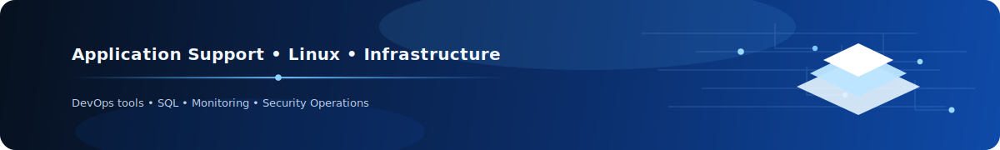

  

# Hi, I'm Nikita

Application Support / Infrastructure Engineer with an Information Security background.

I am focused on application support, infrastructure, monitoring, and security-aware operations. My background combines hands-on technical support, work with high-load systems, incident-related analysis, SQL-based troubleshooting, and academic specialization in Information Security.

## Technologies

## Core stack
- Application Support
- Infrastructure & Monitoring
- Linux
- SQL / PostgreSQL
- Grafana / Kibana
- Docker / Kubernetes
- Python
- Information Security fundamentals

## Current focus
- Application support and technical troubleshooting
- Infrastructure and monitoring
- Secure operations and security-oriented analysis
- Observability and incident-related investigation
- Hands-on lab environments for infrastructure and security practice

## Highlighted projects

### [corporate-pki-demo](https://github.com/nikita-diakov/corporate-pki-demo)
A compact PKI lab for enterprise-style digital signatures with FastAPI, SoftHSM2, and X.509 certificate workflows on Ubuntu 24.04.

**Focus:** PKI, certificate lifecycle, PKCS#11 signing, verification, revocation, secure workflows.

### [security-monitoring-github](https://github.com/nikita-diakov/security-monitoring-github)
A compact Ubuntu 24.04 security monitoring lab with Grafana, Loki, Alloy, Nginx, and a lightweight Python detector.

**Focus:** monitoring, observability, log collection, lightweight detection, secure infrastructure practice.

### [offline-wireshark-ai-assistant](https://github.com/nikita-diakov/offline-wireshark-ai-assistant)
Offline-first toolkit: Wireshark PCAP → tshark Markdown reports → GPT4All LocalDocs analysis.

## Currently improving
- Linux administration and troubleshooting
- Monitoring and observability tooling
- SQL and support-oriented diagnostics
- Infrastructure automation
- Security-focused engineering skills

## Connect with me
- LinkedIn: [linkedin.com/in/nikita-diakov](https://www.linkedin.com/in/nikita-diakov)
